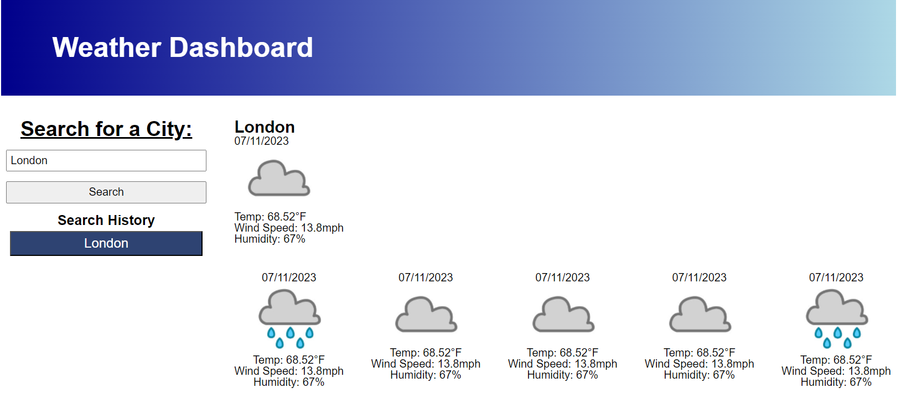

# Weather Dashboard

## Description

This website is a weather dashboard that allows you search current and future conditions for city. The openweather api was used to populate weather data. The application is created with HTML, CSS, powered by Javascript and Day.js.

The dashboard was developed with following criteria:

- When search for a city future and current weather conditions are populated and city is added to search history
- Future weather conditions include 5-day forecast
- Current and future weather conditions include date, icon representation of weather, temperature, humidty, and wind speed
- When click on city in search history presented with current and future conditions for city

## Installation

N/A

## Usage

Enter city name into the input box and click on the search button. The weather will populate on the dashbaord. If you want to re-check the weather of a city in the search history click on the corresponding button in search history.

 

## Credits

N/A

## [Dashboard Link](https://l-lavelle.github.io/Weather-Dashboard/)
